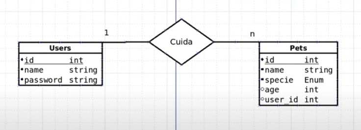
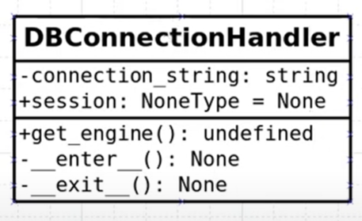
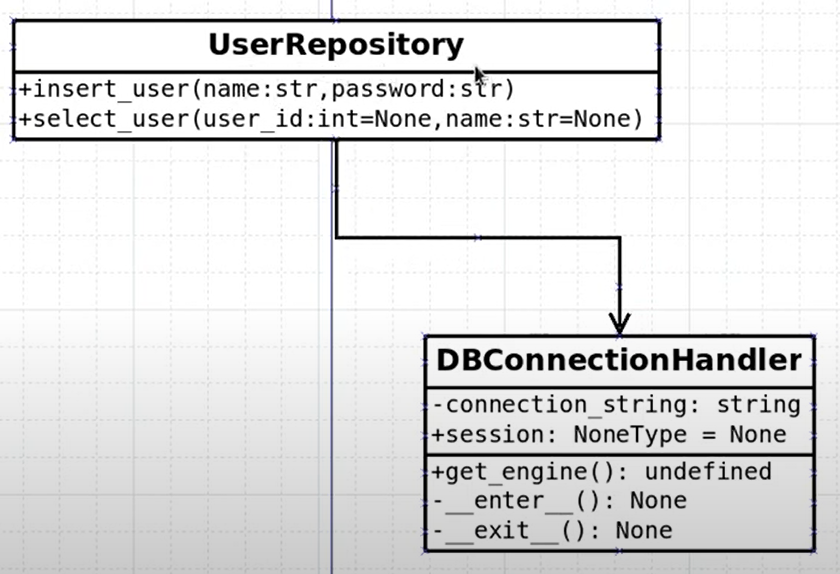
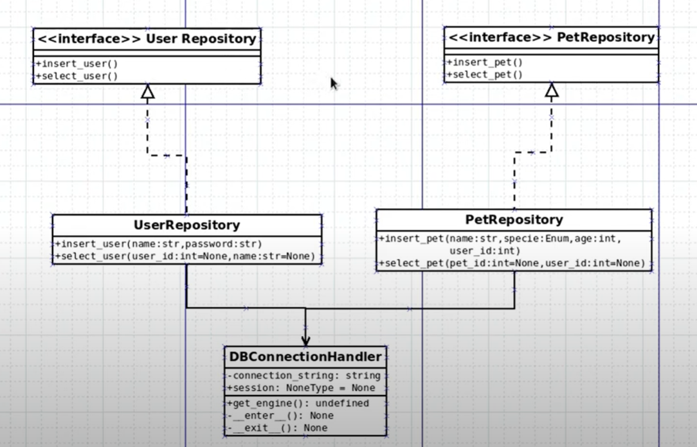
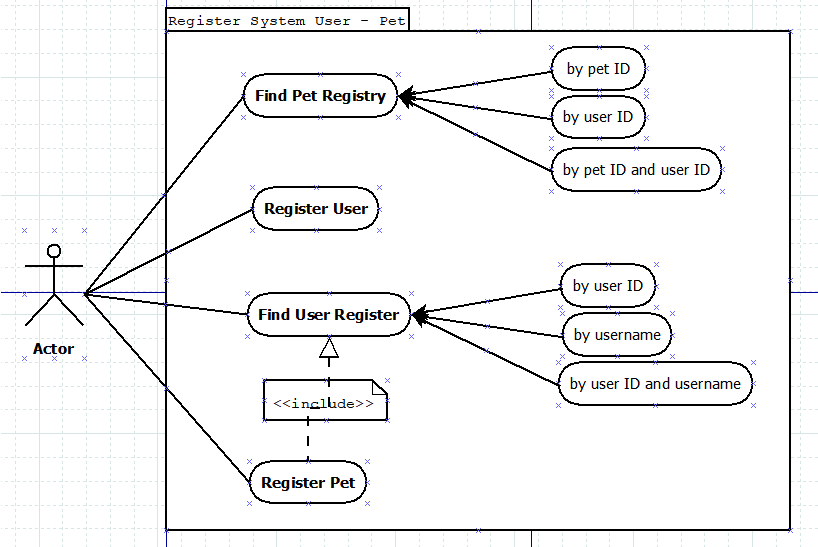
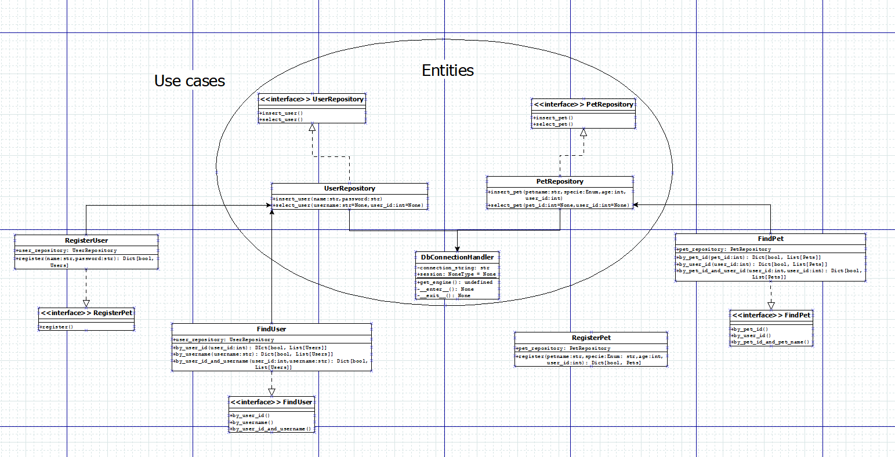

 # my_clean_architecture
Repository based on the Clean Architecture book from Robert C Martin and YouTube classes from "programador Lhama"<br>
#### What to expect:
This course has the objectve to develop a full app to manage USERS and PETS, all the way from a SQL database storage 
data to the interaction with the exterior. Therefore, we must apply all CLEAN ARCHITECTURE concepts.

## Check YouTube channel ["Programador Lhama"](https://www.youtube.com/watch?v=YAMgtR3aCuY&list=PLAgbpJQADBGJmTxeRZKWvdJAoJj8_x3si&index=1)
### Remember that _clean architecture_ basically follow the scheme below:
<br>
Author's explanation of the picture: _"The concentric circles in (above) figure represents areas of software. In general,
the further in you go, the higher level the software becomes. The outer circles are mechanisms. The inner circles are
polices."_<br>
_"Nothing in an inner cicle can know anything at all about something in an outer cicle. In particular, the name of 
<b>something declared in an outer cicle must not be mentioned by any code in an inner cicle</b>. That includes functions
, classes, variables, or any other named software entity"_ p.203<br><br>

#### <b>ENTERPRISE BUSINESS RULES:</b>
Object with method, a set of data structures or function that <b> _can be used_</b>
by many different application.<br>
<b> - Expect not to ever change</b>, except some eventual minor ajustments<br><br>

#### <b>APPLICATION BUSINESS RULES (USE CASES):</b>
Features that orchestrate the flow of data to and from those entities. In general, they do what users want to obtain
by using the software.<br>
<b> - Do not expect changes in this layer to affect _entities_</b><br>
<b> - Also we do not expect the changes in database or UI (dealt by entities) to affect this USE CASE layer.</b><br><br>

#### <b>INTERFACE ADAPTERS:</b>
Convert datas from use cases language to external and convenient languages, such as WEB agencies (e.g. http request in 
REST format). Overall, this layer is implemented to transform external data to internal format data, that allow use 
case and entities to undestand, and then, return to exterior whatever data it has got from inner software within the
most convenient format needed by outer services.<br>
<b> - Expect that no code inward of this layer to deal with any database</b><br><br>

#### <b>FRAMEWORK & DRIVERS:</b>
This outermost layer is where frameworks and tools, such as database and web frameworks, find themselves. It may have 
little amount of code here, thus it might glue code that communicates with inner circles.<br>
<b> - Expect frequent changes to this layer.<b><br><br>

## ENTITIES
## Relation between classes<br>
<br>
- A User takes care of some Pets<br>
### Diagram of a spcific classe<br>
<br>
- Shows how a Class should behave to relate with other classes (Methods and Attributes)<br>
1. We've started setting up the `infra` to store our DB. For this project, we will just use sqlite throught sqlalchemy<br>
- CREATE: `infra/config/db_config.py`
- CREATE: `<db/config.py> class DbConnectionHandler` and follow the image 2.<br>
- CREATE: `infra/config/db_config.py` to tell sqlalchemy what is going to be inside DB and their relationship between them<br>
- CREATE: `<db_config.py> Base = declarative_base()` '(_from sqlalchemy.ext.declarative import declarative_base_)'.
This to awake DB.<br>
- EDIT: `<config/__init__.py>` and point what to export > `from .db_base import Base` and `from .db_config_py import 
DbConnectionHandler`<br><br>

- CREATE: `infra/entities/` to stablish the TABLE for the DB<br>
- CREATE: `infra/entities/pets.py` and `infra/entities/users.py` that are going to be the main actors in this project<br>
- CREATE: `<users.py> class Users(Base)`, importing Base from our `config`, and also import TABLE features from sqlalchemy,
such as Column, String, Integer<br>
- CREATE: `<pets.py> class Pets(Base)`, importing Base from our `config`, and also import TABLE features from sqlalchemy,
such as Column, String, Integer<br>
- EDIT: `<entities/__init__.py>` and point what to export > `from .pets import Pets` and `from .users import Users`<br><br>

- RUN TERMINAL:<br>
`$ python`<br> `>>> from src.infra.config import *` <br>`>>> from src.infra.entities import *` <br>
`# CHECK IF EVERYTHING HAS BEEN INSTATIATED`<br>
`>>> Base` <br> `<class 'sqlalchemy.orm.decl_api.Base'>` <br>
`>>> DbConnectionHandler` <br> `<class 'src.infra.config.db_config_py.DbConnectionHandler'>` <br>
`>>> Users`<br>`<class 'src.infra.entities.users.Users'>`<br>
`>>> Pets`<br>`<class 'src.infra.entities.pets.Pets'>`<br>
`# EVERYTHING SEEMS TO BE FINE. CONTINUING...`<br>
` >>> db_conn = DbConnectionHandler()`<br>
`# CHECK OBJECT DB_CONN`<br>
`>>> db_conn` <br> `<src.infra.config.db_config_py.DbConnectionHandler object at 0x000001FC4303F730>`<br>
`# CALL ENGINE TO PUT PARTS TOGETHER`<br>
`>>> engine = db_conn.get_engine()`<br> `>>> engine`<br> 
`Engine(sqlite:///storage.db)`<br>
`# COMMAND THE CREATION OF THE FILE SQLITE DB`<br>
`>>> Base.metadata.create_all(engine)`<br>
<br>

- SEE: `storage.db` must have been created in your project's root

### TIP to create and manage DB FROM SQLALCHEMY:<br>
1. When stablishing a connection, you have to set up a ENGINE:<br>
2. Define a SESSION, which is NONE initially, but recieves a value after started<br>
3. Define _ _ enter _ _() and _ _ exit _ _() methods to set up a session every time the class 
is called, ado close in the end
<br>

```
from sqlalchemy import create_engine
from sqlalchemy.orm import sessionmaker

class DbConnectionHandler:

    def __init__(self):
        self.__connection_string = "sqlite:///storage.db"  # This string is need by sqlalchemy
        self.session = None

    def get_engine(self):
        """
        Create a connection to DB
        :return: connection engine
        """
        engine = create_engine(self.__connection_string)
        return engine

    # Define a method to enter DB to garantee some levels of security
    def __enter__(self):
        engine = create_engine(self.__connection_string)
        session_maker = sessionmaker()
        self.session = session_maker(bind=engine)
        return self

    def __exit__(self, exc_type, exc_val, exc_tb):
        self.session.close()
```
<br>

5. Finally, when introducing new data in DB, call `session` and one of this four commands:
- <connection_name>.session.add( <new_data> )<br>
- <connection_name>.session.commit()<br>
- <connection_name>.session.rollback()<br>
- <connection_name>.session.close()<br>
- OBS: generally, this features are used with <b>try / finally</b> resource<br>
<br>
## CREATING A USERREPOSITORY AND PETREPOSITORY CLASS<br>
<br>
- Now it is time to set up a USER REPOSITORY and a PET REPOSITORY CLASS that will call both entities and
database as desired

## THE FULL PICTURE - DEVELPMENT DIAGRAM<br>
<br>

## USECASE FOR USER AND PET
<br>
- ACTOR: Our user. He can performe all this actions described in the diagram;<br>
- ACTIONS: Generic descriptions of all possible interaction allowed for this actor;<br>
- INCLUDE : A small dependency brought by diagram telling that a User must be related to a Pet everytime;<br>
- BY METHODS : List of required information to perform a database query.<br>
In the end, use case diagram followed as this:<br>
<br>
<_see it better in `.dia` file_><br>

## CONTROLLER DIAGRAM


